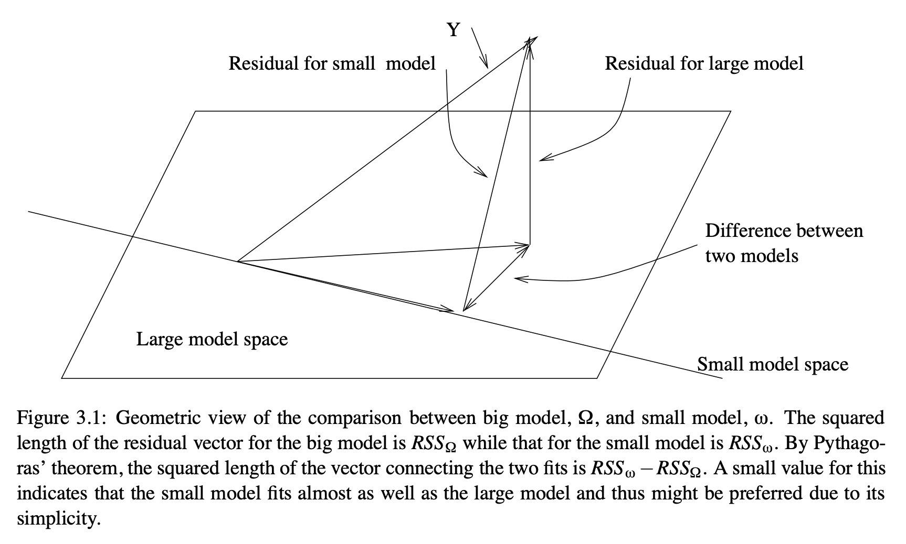

# Parametric inference in the GLM

In this context, inferences are conclusions about whether an effect exists. P-values are a tool for  inference. In parametric statistics, P-values are derived based on estimates of the effect magnitude (e.g., mean difference, slope $ \beta_j $, or other magnitude estimate) and its standard error.

## T-test

A t-test in the context of a regression analysis is commonly used to test if a particular coefficient, say $\beta_j$, is significantly different from zero. The t-statistic for testing $\beta_j = 0$  in a multiple regression context using matrix notation can be written as:

$$ t_j = \frac{\hat{\beta}_j}{\hat{\sigma}\sqrt{(X^T X)^{-1}_{jj}}} $$

Here:

- $\hat{\beta}_j$  is the estimated coefficient for the $j$ -th predictor.
- $\hat{\sigma}^2$ represents the estimated variance of the residuals, and can be calculated as:

$$ \hat{\sigma}^2 = \frac{e^T e}{n-p} $$

where $e$ is the vector of residuals, $n$ is the number of observations, and $p$ is the number of predictors, including the intercept.

- $(X^T X)^{-1}_{jj}$  is the $j$ -th diagonal element of the inverse of the matrix $X^T X$ , which is the matrix of sums of squares and cross-products of the design matrix $X$ .

The P-value comes from a t-distribution, which is a Normal (Gaussian) distribution adjusted for the fact that there are not really $n$ independent observations, and thus not really $n$ error df, if we have estimated some parameters ($p$ parameters, to be precise) and removed them when estimating the residual error. The t-statistic, $t_j$ , can be compared to a t-distribution with $n-p$  degrees of freedom to determine the significance of the $j$ -th predictor.

## Contrasts

Often, there will be many regressors in a model, and we wish to test a particular linear combination of them. Linear combinations of parameter estimates $\hat{\beta}$ are termed **contrasts**.

The $p \space x \space k$ contrast matrix $C$ describes a set of column vectors that define a set of $k$ linear combinations of the $p$ coefficients.

$$ \hat{C^T\beta} = C^T\hat{\beta} $$

We assume by convention that the first parameter is $\hat{\beta_0}$ corresponding to the intercept.

Contrasts can code differences across regressors of interest. e.g., for the difference between parameters 1 and 2:

$$
\hat{C^T\beta} = \begin{bmatrix}0 & 1 & -1 & \cdots & 0\end{bmatrix}^T
*
\begin{bmatrix}
\hat{\beta_0} \\
\hat{\beta_1}\\
\hat{\beta_1} \\
\vdots \\
\hat{\beta_p} \\
\end{bmatrix}
$$

We refer to this as a t-contrast, as it provides a t-test for the linear combination of parameters, provided that the expected value $E(\hat{C^T\beta}) = 0$ under the null hypothesis.

More details are here:
[Contrast Powerpoint](ppt/Wager_GLM_CompFound_Contrasts_Efficiency.pptx)

To make inferences about contrasts, we need an expression for the variance of the contrast.
We apply C to the variance of $\hat{C^T\beta}$:

$$
var(\hat{C^T\beta}) = \sigma^2C^T{X^TX}^{-1}C
$$

This is a variance-covariance matrix of contrast values. The variances of each contrast are on the diagonals of this matrix.

The t-values are thus:

$$

t_{C^T\beta} = \frac{C^T\hat{\beta}}{{(\sigma^2{diag(C^T{(X^TX)}^{-1}C}))}^{1/2}}

$$

## F-test

In the context of the GLM, the F-test is used to compare the fits of different models. Specifically, it's used to test the hypothesis that a set of predictors has no effect on the response variable.

Given:

- $SSR_{\text{full}}$  = Sum of Squared Residuals for the full model
- $SSR_{\text{reduced}}$  = Sum of Squared Residuals for a reduced model
- $p$  = Number of predictors in the full model
- $q$  = Number of predictors in the reduced model (with $q < p$ )
- $n$  = Total number of observations

The F-statistic is calculated as:

$$ F = \frac{(SSR_{\text{reduced}} - SSR_{\text{full}}) / (p - q)}{SSR_{\text{full}} / (n - p)} $$

In matrix notation, the sum of squared residuals for a model can be expressed as:

$$ SSR = e^T e $$

Where $e$  is the vector of residuals, which can be computed as:

$$ e = Y - X\hat{\beta} $$

Where $Y$  is the response vector, $X$  is the design matrix, and $\hat{\beta}$  is the vector of estimated coefficients.

When comparing two models, the F-statistic tests the null hypothesis that the reduced model is adequate against the alternative that the full model is better.

The P-value comes from an F-distribution with $(p-q, n-p)$ degrees of freedom.  The first number is the degrees of freedom (dimensionality) of the model subspace (or, here, the comparison subspace), and the second number is the error df (dfe.)

A geometric explanation is provided here, courtesy Julian Faraway's book.
The full model spans a $p$-dimensional subspace, including the intercept.  The reduced model spans a $q$-dimensional subspace. In the diagram below, $p$=2, so the model spans a plane, and $q$=1, so the reduced model spans a line. (This would be an intercept-only model.) The distance between the fitted responses for the full and reduced models is a vector in $p-q$-dimensional space.

Faraway also shows the F-test for the full model, comparing a model with all predictors to one with only to the intercept, as follows:

## Assumptions

Parametric inference relies on the assumption that the errors are IID: Independent and identically distributed. This implies that the errors are spherical in a geometric sense: Each lies in a different dimension from all the others, with equal potential magnitude (though estimates may vary). The assumption of **sphericity** entails no correlations between errors $e_i$ and $e_j$ for all $i, j$.
- No correlations across time
- No subgroups with different error variances
- No subgroups of observations that are correlated with other observations (e.g., because they are collected from the same individual).

In addition, they rely on the assumption that the errors are normally distributed, $e ~ N(0, \sigma^2I) $.

In addition to understanding the assumptions made by any statistical test, we must consider the consequences of violating the assumptions.

If sphericity is violated, we will over-estimate the dfe, and P-values will be too liberal in general. Thus, it is very important to correct the dfe for non-sphericity if there are dependencies.  Mixed effects models estimate these dependencies and adjust for them, but this falls beyond the scope of the basic GLM. Repeated-measures models also include dfe corrections. In particular, one can estimate multiple **variance components**, or error variances from subgroups or nearby measurements in time.

If normality is violated, In practice, parametric statistics are not so strongly affected. This is due to the Central Limit Theorem, which posits that the standard error of $\hat{\beta_j}$ becomes normally distributed as $n$ increases, no matter what the distribution of $e$.

## Activity

1. Extend your hand-coded GLM to calculate t-tests for each $\hat{\beta}$ (t values, P-values, and dfe). Print these in a table.

2. Calculate an F-statistic, df, and P-value for the overall model $R^2$, comparing the full model to an intercept-only model.

3. Add the ability to perform t-tests for a set of contrasts.  

4. Make your script into a function that takes in a design matrix ($X$), data ($y$), and optional contrast matrix ($C$).

Generally, your code will be Python, R, or Matlab.
