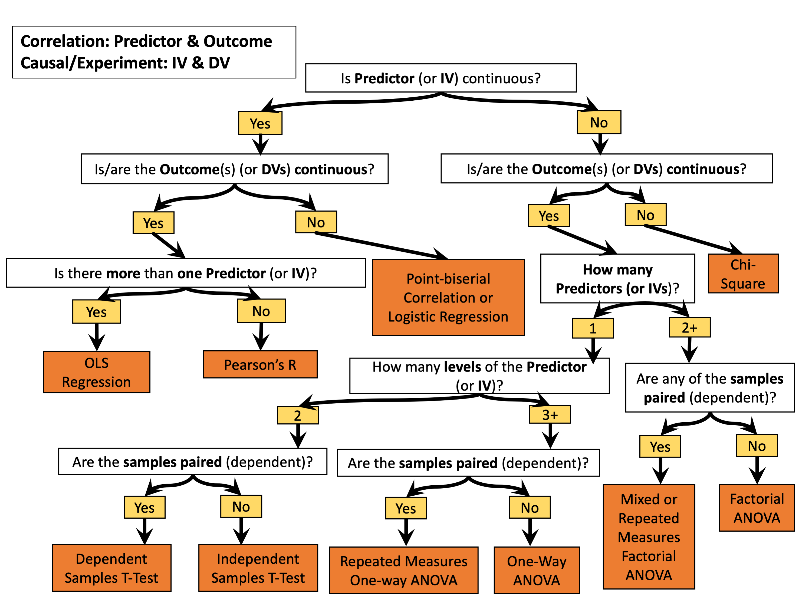
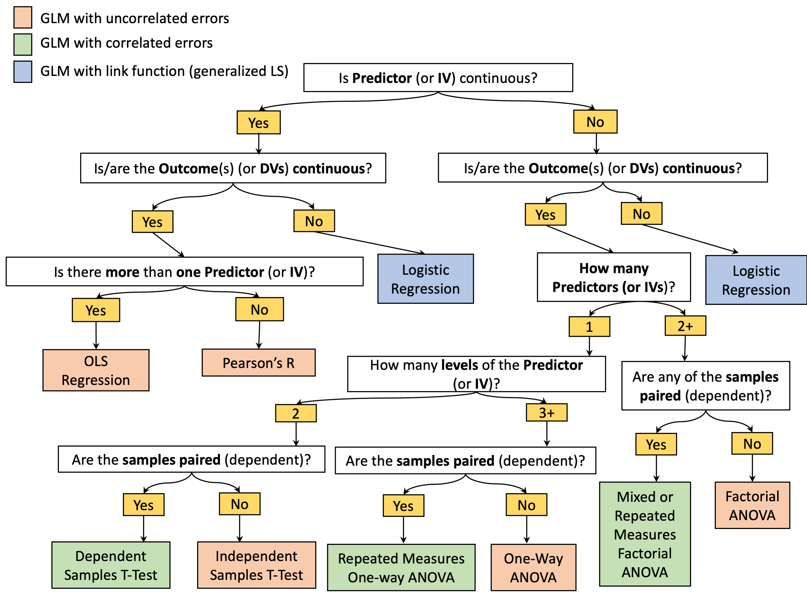
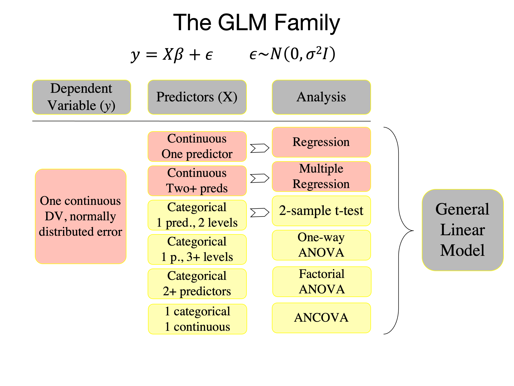

# Some resources

## Basic background
Jeanette Mumford has a great series of videos on regression (and other series too, on mixed effects, fMRI)

[Basic statistics terminology](https://youtu.be/apt8uAgtgdY) This video gently introduces some of the key concepts that provide the foundation for statistics.
[Simple Linear Regression](https://www.youtube.com/watch?v=yLgPpmXVVbs) This video explains how a regression works using a single variable.
[Matrix Algebra Basics](https://www.youtube.com/watch?v=fkZj8QoYjq8) This video provides the background linear algebra needed for understanding the GLM.
[Multiple Linear Regression](https://www.youtube.com/watch?v=qdOG7YMolmA) This video explains how multiple regression works using linear algebra.
[Hypothesis Testing](https://www.youtube.com/watch?v=ULeg3DH3g9w) This video covers the basics of hypothesis testing.
[Contrasts in Linear Models](https://www.youtube.com/watch?v=yLgPpmXVVbs&t=631s) This video provides an overview of how to test hypotheses using contrasts in the context of the GLM.
[Interpreting Regression Parameters](https://www.youtube.com/watch?v=uClfe4pLrCo) This video covers how to interpret the results from a regression analysis.
[Mean Centering Regressors](https://www.youtube.com/watch?v=K4S576j90N8) This video covers a more subtle detail of why you might consider mean centering your continuous regression variables.

## Greek alphabet

## Probability distributions

We won't cover these extensively, but it would be good to integrate in the future:
https://awstip.com/statistical-probability-distributions-89398c4b68c7
https://en.wikipedia.org/wiki/Relationships_among_probability_distributions

# Choosing a statistical test

Here is a guide to choosing a statistical test in the classic way, courtesy of the University of Colorado, Boulder psychology stats instructors:

You can use a GLM for all of these tests, and more complex designs as well. Here's a re-do of this breaking it down by (1) Whether there are correlated errors or not, and (2) Whether you need a link function to link the linear model to outcomes.

Here's a reorganization of statistical tests that are all examples of a GLM with uncorrelated errors.

Here are repeated measures tests:

## Getting started with programming

There are many resources -- the key is finding which are most useful!

These may be useful for Matlab:
- [Getting started with Matlab](https://matlabacademy.mathworks.com/details/matlab-onramp/gettingstarted)
- [Matlab fundamentals](https://matlabacademy.mathworks.com/details/matlab-fundamentals/mlbe)

**Machine learning**
- [Matlab Machine Learning Onramp](https://matlabacademy.mathworks.com/details/machine-learning-onramp/machinelearning)
- [Matlab Deep Learning Onramp](https://matlabacademy.mathworks.com/details/deep-learning-onramp/deeplearning)

**Reinforcement learning**
- [Matlab Reinforcement Learning Onramp](https://matlabacademy.mathworks.com/details/reinforcement-learning-onramp/reinforcementlearning)
- https://www.mathworks.com/help/reinforcement-learning/getting-started-with-reinforcement-learning-toolbox.html?s_tid=CRUX_topnav

**Google Colab machine learning with tensor flow**
- https://colab.research.google.com/?utm_source=scs-index#scrollTo=P-H6Lw1vyNNd
- https://www.tensorflow.org/hub/tutorials/tf2_text_classification

**Mixed effects in Python**
- https://www.pythonfordatascience.org/mixed-effects-regression-python/
- https://towardsdatascience.com/how-to-run-linear-mixed-effects-models-in-python-jupyter-notebooks-4f8079c4b589
- https://gist.github.com/jcheong0428/f25b47405d9d328691c102787bc92175
